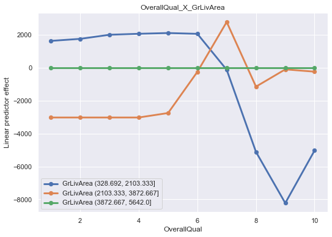

# `lgbmvisualizer` 
A python packaging for finding and visualising the most dominant interactions between variables in your model(including multi-classification models) using LightGBM trees.

<br>

## `How to use this package?`
`lgbmvisualizer` lets users find the most impactful interaction between variables in your data & plots them quickly.
```bash

# Lets say below are the LightGBM parameters of your model.
params = {'learning_rate': 0.04, 
          'max_depth': 8, 
          'num_leaves': 999, 
          'reg_lambda': 7.590589358300042, 
          'bagging_fraction': 0.6200762468698007, 
          'bagging_freq': 1, 
          'reg_alpha': 20.684874282108627, 
          'min_gain_to_split': 7.6153442293342675, 
          'cat_l2': 20.31189949433954, 
          'feature_fraction': 0.4, 
          'max_cat_threshold': 48, 
          'cat_smooth': 3.7565474645348047, 
          'verbosity': -1, 
          'objective': 'rmse'
         }

#LGBMVisualizer will now fit a model based on the parameters specified above to compute shap interaction values
lgbm_viz = LGBMVisualizer(params=params, 
                        data=df, 
                        target_column=target_column, 
                        weight_column=weight_column, 
                        n_trees=200,
                        twofold_shap=False, 
                        pc_data_for_interaction_detection=0.5)

#Now that shap values are computed, we can plot them using the find_interactions() functions
lgbm_viz.find_interactions(variables=("OverallQual", "GrLivArea"))
```


<br>

## How does `lgbmvisualizer` find the most impactful interactions in my data?

To find the most impactful interactions you can either specify 
1. a single variable name, in which case the package plots  `N` number of most important interactions involving that variable,
2. a tuple of 2 variable names, in which case the package just returns a single plot of the interaction trend between those 2 variables.
3. a list of variable names, which would plot `N` number of most important interactions involving those variable.

In the backend `lgbmvisualizer` uses the [SHAP](https://github.com/slundberg/shap) package and [LightGBM](https://lightgbm.readthedocs.io/en/latest/) packages. First the package builds a LightGBM model & computes shap interaction values using one of the 2 methods:
1. When `twofold_shap` is set to `False`, only a single LightGBM model is trained at the start & the SHAP values using this model are used to plot the interactions. These can be incredibly time consuming if you have a large dataset, so choosing the second option below would be a better option. But if the user wants to explore only shap values & also want a less time consuming solution, you can use the `pc_data_for_interaction_detection` argument that lets you chose what percentage of your data you want to use to compute the SHAP values. So as the data size gets smaller, the computation becomes quicker.

2. When `twofold_shap` is set to `True`, a second model is trained to fit the SHAP interaction values so as to remove the vertical dispersion caused by other variables. Scatter plotting the SHAP main effects of a variable would show that the values are vertically dispersed & this is due to the interaction effects from other variables for that particular data point. By fitting a second model on the SHAP values themselves allows the package to understand which variables interact with the variable in question(i.e the first variable if its a tuple). Use this method if the runtime of the first one is high & can help in getting similar results much more quicker. 
 
To summarise, both these options give you similar results with `twofold_shap` is set to `True` being lot less time consuming for big datasets. 


To explore more features of this package, see the [Example.ipynb](tutorial/Example.ipynb) in the tutorial folder.

## How do I install this package?
You can install it directly using the below command:
```bash
pip install git+ssh://git.forge.lmig.com:7999/dsprg/visintree.git
```

OR

Clone the repository , `cd` into the directory & run the below command:
```bash
pip install .
```


